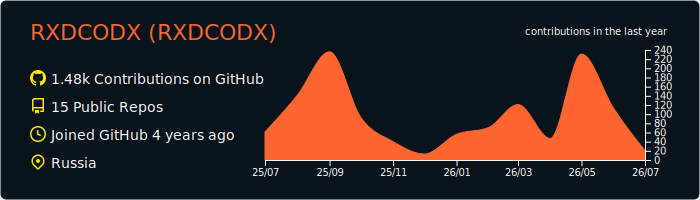
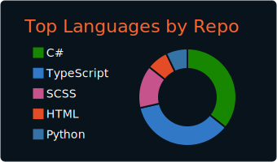
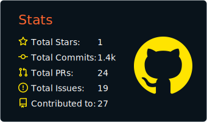
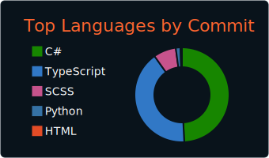
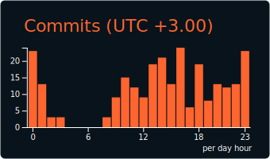

<div align="center">

<!-- RED CODE RAIN — MATRIX EFFECT -->


<!-- TYPING HEADER -->
[](https://git.io/typing-svg)

<!-- AVATAR WITH ELECTRIC BORDER -->


<!-- DIVIDER -->


</div>

---

### 

```yaml
name: RXDCODX
role: Full Stack Developer
focus:
  - Backend Architecture
  - Frontend Engineering
  - Real-time Systems
  - Streaming Platforms
passions:
  - Open Source
  - AI & Machine Learning
  - System Programming
motto: "Red Code — every line matters"
```

---

### 

<div align="center">

#### 


#### 


#### 


#### 


#### 


#### 


#### 


#### 


</div>

---

### 

<table>
<tr>
<td width="50%">

#### MARS.Server
> Multi-platform integration hub for live streaming — Twitch, Telegram, Discord, Spotify, YouTube, OBS and more. Real-time communication via SignalR, powered by ASP.NET Core and PostgreSQL.

**Tech:** `C#` `.NET 10` `ASP.NET Core` `SignalR` `Entity Framework` `PostgreSQL` `Docker`

[](https://github.com/RXDCODX/MARS.Server)

</td>
<td width="50%">

#### MARS.Client
> Streaming platform client — real-time overlays, interactive widgets, scoreboard, sound requests, and more. Built with modern React tooling and auto-generated API clients from Swagger.

**Tech:** `TypeScript` `React` `Vite` `Tailwind CSS` `Ant Design` `Zustand` `SignalR`

[](https://github.com/RXDCODX/MARS.Client)

</td>
</tr>
</table>

---

### 

<div align="center">

#### 

<a href="https://github.com/RXDCODX">
  
</a>

<table>
<tr>
<td></td>
<td></td>
</tr>
<tr>
<td></td>
<td></td>
</tr>
</table>

#### 


</div>

---

### 

<div align="center">

<picture>
  <source media="(prefers-color-scheme: dark)" srcset="https://raw.githubusercontent.com/RXDCODX/RXDCODX/output/github-snake-dark.svg"/>
  <source media="(prefers-color-scheme: light)" srcset="https://raw.githubusercontent.com/RXDCODX/RXDCODX/output/github-snake.svg"/>
  
</picture>

</div>

---

<div align="center">


</div>
